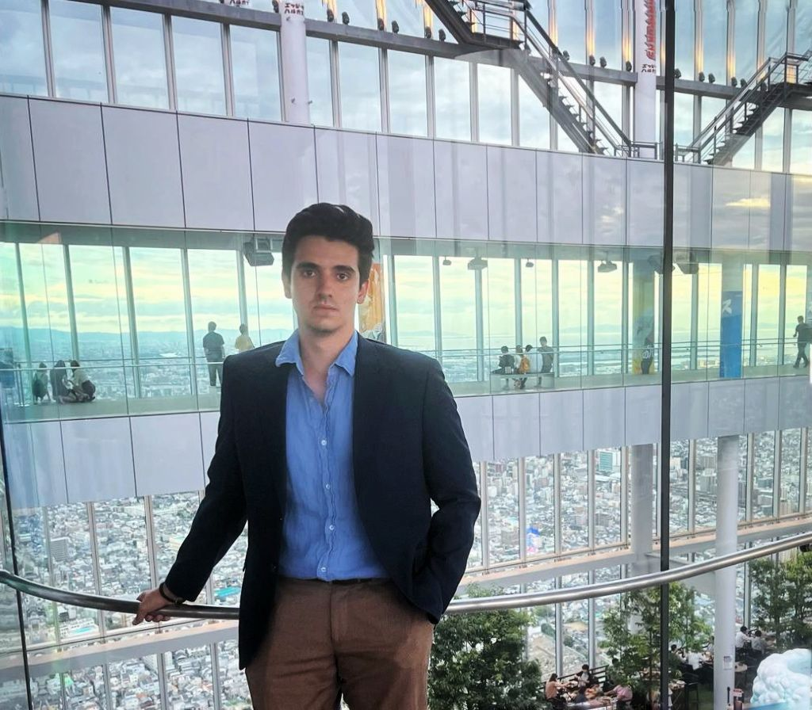

# The Quanty Bounty

One of the most ambitious projects made by a Spanish student, for other Spanish-speaking students :)

### About Me

Hi, y'all! Welcome to the repository of my most ambitious project: the Quanty Bounty. Before delving into this project, I want to present myself.

  

My name is Iker Caballero Bragagnini, I am a graduate student in Statistics and Mathematics with a background in Economics and Econometrics. I also work in the financial industry as a Quantitative Researcher & Developer for a Dutch fund and I also worked as a Quantitative Risk Analyst at Deloitte. My passion is mathematics and statistics, and I specialize in mathematical finance and financial statistics. Hence, most of the time I study technical topics.

### My Ambition

The main ambition of the Quanty Bounty is to become one of the most complete sources of information and academic resources for Spanish-speaking students and others interested in technical disciplines like mathematics, statistics, and computer science, but also in important areas for society such as economics. These are notes based on the most relevant literature in the different areas and have been written by me during my studies and my free time.

I want every Spanish-speaking person to have free access to educational resources in the disciplines I am most interested in, and I hope readers can build a collaborative space to help each other.

### The Notes

If you want to tell me about some typos or recommendations, please contact me at ikercb2014@icloud.com.

